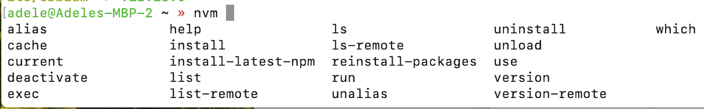
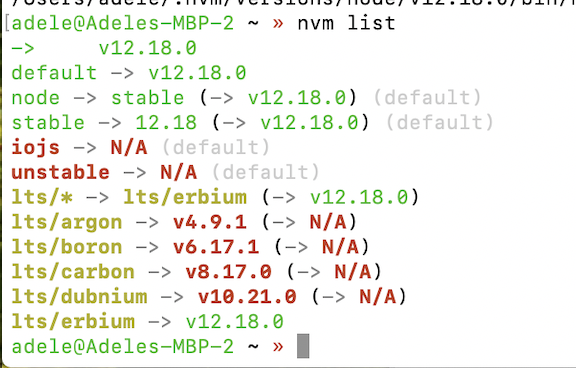

# Installing Node.js on macOS

> A simple guide on how to setup Node.js development environment on macOS.

Node.js is an open-source runtime environment, which allows developers to create networked applications and web-servers in JavaScript. For instance, you can use Node.js to build your blockchain.

In this post, I’ll explain how to install Node.js in a macOS environment. 

This post is intended for complete beginners to JavaScript or for folks switching from Python to JavaScript for their backend production. It doesn’t assume any background knowledge of JavaScript (although it doesn’t hurt to have some!). However, this tutorial will cover everything you need to know and hopefully will get you up to speed in no time!

Ready? Let’s jump in.

To check whether you already have Node installed, open new _terminal_ window and type:

```
node -v
```

If you have Node installed, it should output Node’s version. If you don’t, you’ll see one of the two messages, depending on whether you use `bash` *or* `zsh` shell: 

- `bash: command not found: node`
- `zsh: command not found: node`

That means that the command you are trying to run is not installed. But worry not, there are several ways to install Node.js: 

1) using the macOS installer available from the Node.js [website](https://nodejs.org/en/download/) 
2) using `homebrew` to install and update Node.js
3) using `nvm` to install and update Node.js

I’ll go over each way step-by-step.

## 1) Using the macOS installer available from the Node.js website

Visit the Node.js [website](https://nodejs.org/en/download/) where you can download a pre-built installer for your mac platform. 

There are two types of Node.js releases: **long-term support (LTS)** and **current**. LTS releases are more polished and bug-free and will suffice for the majority of everyday users. Current releases are typically more experimental and contain the latest features, which may not be completely finished and could *occasionally* crash. You can switch between LTS and current versions by highlighting the field in the first tab. Again, the LTS version is recommended for most users. Therefore, if the LTS tab is highlighted in dark green, you can simply click on the macOS Installer option, which will download the `.pkg` installer for Node.js. 

1. Download the Node.js `.pkg` Installer:
   - Opening `node-v12.18.0.pkg`
     - Select `Open with Installer (default)`
     
2. Run the `.pkg` Installer and follow the instructions that will guide you through the interface:
   - Introduction
     - Select `Continue`
     
   - License
     - Select `Continue`
     - Select `Agree`
     
   - Installation Type
     - Select `Install`
     - Authenticate using your macOS password to install the software
     - Select `Install Software`
     
   - Summary; you should see that Node.js and `npm` were installed
     - Select `Close`

3. Double-check that Node.js was installed:

```
node -v
```

You should now see output `v12.18.0` or some other version of the software that's just been installed.

## 2) Using `homebrew` to install and update Node.js

Homebrew is arguably the most popular package manager for macOS and makes installing Node.js straightforward. Let's check whether you have Homebrew installed:

```
brew -v
```

If Homebrew is installed on your mac, you should see its version, for example, `Homebrew 2.3.0`. If not, you can install Homebrew via:

```
/usr/bin/ruby -e "$(curl -fsSL https://raw.githubusercontent.com/Homebrew/install/master/install)"
```

Assuming that Homebrew is already installed, type:

```
brew update
brew install node
```

And that’s all you need. Again, try `node -v` to confirm the version of Node.js installed.

While using Homebrew for Node.js installation is very easy, it comes with one disadvantage. **Unfortunately, Homebrew has a specific habit of installing only the latest version of Node.js**. This could be a problem because sometimes applications require a certain version of Node.js to work. Having the flexibility of using specific versions can be an asset. To fix this problem, the best option to install Node.js is via `nvm`.

## 3) Using `nvm` to install and update Node.js (recommended)

Node Version Manager, [nvm](https://github.com/nvm-sh/nvm), is a script to manage multiple active node.js versions. 

1. Open new _terminal_ window
2. Run `nvm` install script
   - The script clones the nvm repository to `~/.nvm` and adds the source lines to your profile (`~/.bash_profile`, `~/.zshrc,` `~/.profile,` or `~/.bashrc`). You can use either `curl` or `wget`:
   
     ```
     curl -o- https://raw.githubusercontent.com/nvm-sh/nvm/v0.35.3/install.sh | bash
     ```
     ```
     wget -qO- https://raw.githubusercontent.com/nvm-sh/nvm/v0.35.3/install.sh | bash
     ```

   - You can also add the source lines manually:
       ```  
       export NVM_DIR="$([ -z "${XDG_CONFIG_HOME-}" ] && printf %s "${HOME}/.nvm" || printf %s "${XDG_CONFIG_HOME}/nvm")"
       [ -s "$NVM_DIR/nvm.sh" ] && \. "$NVM_DIR/nvm.sh" # This loads nvm
       ```

3. Reload the shell configuration, depending on whether you use `bash` *or* `zsh` shell

     - ```source ~/.bashrc```
     - ```source ~/.zshrc```
 
4. Verify the installation

     ```sh
     command -v nvm
     ```

      This should print `nvm` if the installation was successful. 


5. Use `nvm` to install Node.js

   - List the options: 
     > $ nvm <kbd>Tab</kbd>
       
     

   - List all installed versions of Node.js: `nvm ls`. It should print an output like this: 
     
   - Download, compile, and install the latest release of node: `nvm install node` # "node" is an alias for the latest version
   - Install the specific version: `nvm install v12.18.0`
   - Next, to *use* the specific version of Node that you just installed: `nvm use v12.18.0` or something else
   - Print the path to the executable to where it was installed: `nvm which 12.18.0`
   - Change the default Node.js version to let's say 10.20.1: `nvm alias default 10.16.3`
   - Migrate packages from a previous Node.js version: `nvm install node --reinstall-packages-from=node`, for example: `nvm install v12.18.0 --reinstall-packages-from=v10.20.1`
   - Delete an older version: `nvm uninstall v10.20.1`
   - Install and use the LTS version: `nvm install --lts` and `nvm use --lts`
   
   
 6. Use `nvm` to install `npm`

      `npm` stands for [Node Package Manager](https://www.npmjs.com/) is a package management framework for Node.js. It          
      provides a command line utility tool to install Node.js libraries and manage their versions and dependencies. `npm` is  
      analogous to `rubygems` in Ruby or `pip` in Python. 
   
      To install `npm`, use the following command:

      ```
      nvm install-latest-npm
      ```
      Please note that this installs the latest working `npm` on the node version that you're *currently using*, such as `~/.nvm/versions/node/[your-version]/lib/node_modules/npm`. This is something you want because you want to update the `npm` and packages only for that Node.js version which is associated with a specific project and its requirements.

      - List globally installed packages: `npm ls -g --depth=0.`
      - Update all globally installed packages: `npm update -g`. Again, note that this will update packages inside the path of your active Node.js version instead of the system global path.

All in all, the main benefit of Node Version Manager is its flexibility when it comes to customizing different Node.js versions, which might be needed if you are hopping between different projects and their requirements.


```
brew update
brew install node
```

And that’s all you need. Again, try `node -v` to confirm the version of Node.js installed.

While using Homebrew for Node.js installation is very easy, it comes with one disadvantage. **Unfortunately, Homebrew has a specific habit of installing only the latest version of Node.js**. This could be a problem because sometimes applications require a certain version of Node.js to work. Having the flexibility of using specific versions can be an asset. To fix this problem, the best option to install Node.js is via `nvm`.

## 3) Using `nvm` to install and update Node.js (recommended)

Node Version Manager, [nvm](https://github.com/nvm-sh/nvm), is a script to manage multiple active node.js versions. 

1. Open new _terminal_ window
2. Run `nvm` install script
   - The script clones the nvm repository to `~/.nvm` and adds the source lines to your profile (`~/.bash_profile`, `~/.zshrc,` `~/.profile,` or `~/.bashrc`). You can use either `curl` or `wget`:
   
     ```
     curl -o- https://raw.githubusercontent.com/nvm-sh/nvm/v0.35.3/install.sh | bash
     ```
     ```
     wget -qO- https://raw.githubusercontent.com/nvm-sh/nvm/v0.35.3/install.sh | bash
     ```

   - You can also add the source lines manually:
       ```  
       export NVM_DIR="$([ -z "${XDG_CONFIG_HOME-}" ] && printf %s "${HOME}/.nvm" || printf %s "${XDG_CONFIG_HOME}/nvm")"
       [ -s "$NVM_DIR/nvm.sh" ] && \. "$NVM_DIR/nvm.sh" # This loads nvm
       ```

3. Reload the shell configuration, depending on whether you use `bash` *or* `zsh` shell

     - ```source ~/.bashrc```
     - ```source ~/.zshrc```
 
4. Verify the installation

     ```sh
     command -v nvm
     ```

      This should print `nvm` if the installation was successful. 


5. Use `nvm` to install Node.js

   - List the options: 
     > $ nvm <kbd>Tab</kbd>
       
     

   - List all installed versions of Node.js: `nvm ls`. It should print an output like this: 
     
   - Download, compile, and install the latest release of node: `nvm install node` # "node" is an alias for the latest version
   - Install the specific version: `nvm install v12.18.0`
   - Next, to *use* the specific version of Node that you just installed: `nvm use v12.18.0` or something else
   - Print the path to the executable to where it was installed: `nvm which 12.18.0`
   - Change the default Node.js version to let's say 10.20.1: `nvm alias default 10.16.3`
   - Migrate packages from a previous Node.js version: `nvm install node --reinstall-packages-from=node`, for example: `nvm install v12.18.0 --reinstall-packages-from=v10.20.1`
   - Delete an older version: `nvm uninstall v10.20.1`
   - Install and use the LTS version: `nvm install --lts` and `nvm use --lts`
   
   
 6. Use `nvm` to install `npm`

      `npm` stands for [Node Package Manager](https://www.npmjs.com/) is a package management framework for Node.js. It          
      provides a command line utility tool to install Node.js libraries and manage their versions and dependencies. `npm` is  
      analogous to `rubygems` in Ruby or `pip` in Python. 
   
      To install `npm`, use the following command:

      ```
      nvm install-latest-npm
      ```
      Please note that this installs the latest working `npm` on the node version that you're *currently using*, such as `~/.nvm/versions/node/[your-version]/lib/node_modules/npm`. This is something you want because you want to update the `npm` and packages only for that Node.js version which is associated with a specific project and its requirements.

      - List globally installed packages: `npm ls -g --depth=0.`
      - Update all globally installed packages: `npm update -g`. Again, note that this will update packages inside the path of your active Node.js version instead of the system global path.

All in all, the main benefit of Node Version Manager is its flexibility when it comes to customizing different Node.js versions, which might be needed if you are hopping between different projects and their requirements.
        
       
